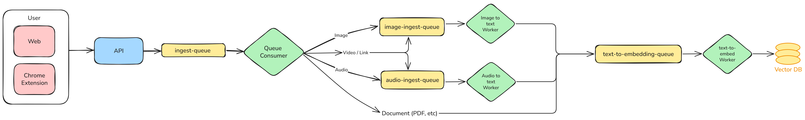

## SMARA – Your Intelligent Memory Space

SMARA is your personal **digital memory** — a place where everything you capture, create, or collect stays alive and easy to find.
Upload **photos, recordings, videos, or notes**, and let SMARA instantly understand and organize them in its own quiet way.

No folders, no filenames, no searching through chaos — just ask naturally: “show me that beach trip last summer” or “find my meeting notes about design ideas” — and it **remembers**.

It’s like giving your mind a second layer — one that never forgets, always ready to bring back the moments, ideas, and knowledge that matter.

## Use SMARA to:

- Relive memories effortlessly through simple, natural questions.
- Keep creative work, voice notes, and visual inspiration all in one searchable space.
- Turn scattered media into connected stories and context.
- Free your mind from remembering where something is — just remember what it was.
- SMARA helps you think less about storage, and more about meaning — a timeless memory companion that grows with you.

## Architecture Overview

SMARA is built on a **serverless, cloud-native stack** powered by Cloudflare Workers and Next.js, designed for intelligent content processing and lightning-fast semantic search.

### Tech Stack

- **Frontend**: Next.js (App Router) on Cloudflare Pages
- **Extension**: Chrome extension built with Plasmo framework
- **Backend**: Cloudflare Workers for processing and search
- **Storage**: Cloudflare R2 (object storage) + D1 (serverless SQLite)
- **AI/ML**: Workers AI (Whisper ASR, CLIP vision, embeddings)
- **Search**: Vectorize (vector database for semantic search)

### How It Works

1. **Capture** - Upload content from web UI or capture from any website via Chrome extension
2. **Process** - AI workers extract meaning:
   - Images → visual descriptions (CLIP)
   - Audio → transcriptions (Whisper)
   - Video → audio + frame analysis
   - Text → semantic embeddings
3. **Search** - Query naturally; vector search finds content by meaning, not just keywords

### Architecture Highlights

- **Async Processing Pipeline**: Queue-based architecture handles heavy media processing without blocking
- **Real-Time Search**: Direct API for instant semantic search results
- **Multi-Source Capture**: Web UI and Chrome extension feed the same unified pipeline
- **Secure & Private**: User-isolated data, signed URLs, JWT authentication

For detailed technical documentation, see [architecture.md](docs/architecture.md).