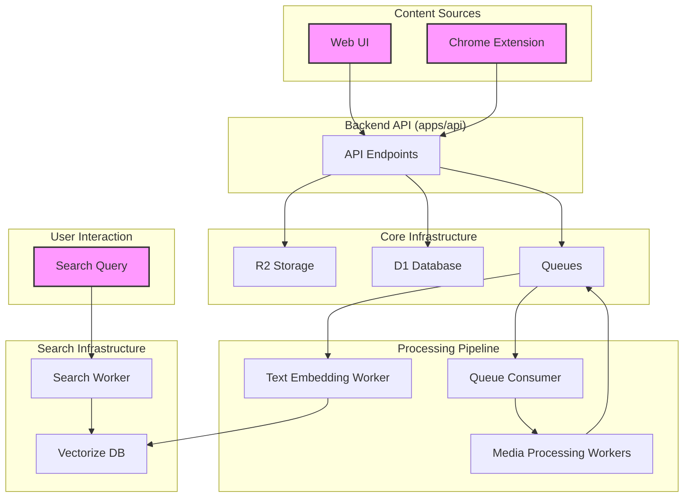

# SMARA Architecture

This document provides a comprehensive overview of the SMARA project's architecture, from the high-level system design to the responsibilities of individual components.

## 1. System Architecture Overview

SMARA is a cloud-native application built on a serverless stack using Cloudflare Workers and Next.js. It's designed for capturing, processing, and searching various types of content, with a focus on asynchronous processing and real-time search capabilities.



## 2. Folder Structure

The project is organized as a monorepo using pnpm workspaces and Turbo.

```
SMARA/
├─ apps/
│ ├─ api/
│ ├─ browser-extension/
│ └─ web/
├─ docs/
├─ infra/
│ ├─ d1_migrations/
│ └─ wrangler.global.jsonc
├─ packages/
│ ├─ constants/
│ ├─ schemas/
│ └─ utils/
├─ workers/
│ ├─ audio_to_text/
│ ├─ image_to_text/
│ ├─ queue_consumer/
│ ├─ search/
│ ├─ text_to_embedding/
│ └─ video_to_text/
└─ package.json
```

-   **`apps/`**: Contains the user-facing applications (Next.js web app, backend API, and Chrome extension).
-   **`workers/`**: Holds the Cloudflare Workers responsible for background processing and search.
-   **`packages/`**: Shared libraries for code reuse across the monorepo.
-   **`infra/`**: Infrastructure-as-code, including D1 migrations and global configurations.

## 3. Cloudflare Services & Canonical Bindings

All workers and applications use a consistent set of binding names for Cloudflare services:

-   **R2**: `R2`
-   **D1**: `DB`
-   **Vectorize**: `VECTORIZE`
-   **Queues**: `smara-ingest-queue`, `smara-embedding-queue`
-   **AI**: `AI`

## 4. Worker Responsibilities

### `queue_consumer`

-   **Trigger**: Messages from `smara-ingest-queue`.
-   **Responsibility**: Acts as a router, inspecting the `modality` of a message and forwarding it to the appropriate media processing worker.

### Media Processing Workers

-   `image_to_text`: Generates descriptions for images using a CLIP/Vision model.
-   `audio_to_text`: Transcribes audio files using Whisper.
-   `video_to_text`: Extracts audio for transcription and samples frames for image descriptions.

### `text_to_embedding`

-   **Trigger**: Messages from `smara-embedding-queue`.
-   **Responsibility**: Converts text into vector embeddings and upserts them into the Vectorize database.

### `search`

-   **Trigger**: Direct HTTP POST requests.
-   **Responsibility**: Provides a real-time vector search API for user queries.

## 5. Chrome Extension Architecture

The Chrome extension is built using the Plasmo framework and allows for seamless content capture from any website.

-   **Content Scripts**: Interact with web pages to capture text, images, and video bookmarks.
-   **Background Service Worker**: Manages API communication, authentication, and coordination.
-   **Popup UI**: Provides a user interface for quick actions, recent captures, and a mini search interface.

## 6. API Architecture (`apps/api`)

The backend API is the central hub for handling requests from the web UI and the Chrome extension.

-   **Authentication**: Manages JWT tokens.
-   **Upload Handling**: Generates signed R2 URLs for secure uploads.
-   **Queue Management**: Publishes messages to the `smara-ingest-queue` to kick off the processing pipeline.
-   **Search Proxy**: Forwards search requests to the `search` worker.

## 7. Queue Architecture

The queuing system is the backbone of the asynchronous processing pipeline.

```
Content Source → Backend API → smara-ingest-queue → queue_consumer
                                                         ↓
Media Processing Workers ---------------------------------> smara-embedding-queue → text_to_embedding
                                                                                         ↓
                                                                                Vectorize (searchable)
```

-   **`smara-ingest-queue`**: The entry point for all new content.
-   **`smara-embedding-queue`**: Holds text ready to be converted into vector embeddings.

## 8. Data Model (D1)

The D1 database stores metadata about the assets and the results of the processing pipeline.

```sql
CREATE TABLE assets (
  id TEXT PRIMARY KEY,
  user_id TEXT NOT NULL,
  r2_key TEXT NOT NULL,
  -- ... and other fields
);

CREATE TABLE text_chunks (
  asset_id TEXT NOT NULL,
  chunk_id TEXT NOT NULL,
  text TEXT NOT NULL,
  -- ... and other fields
);
```

## 9. Deployment & Development

The project uses pnpm scripts and Turbo for an efficient development and deployment workflow.

-   `pnpm dev:*`: Starts development servers for individual apps/workers.
-   `pnpm build`: Builds all apps and workers.
-   `pnpm deploy:*`: Deploys specific parts of the application.

## 10. Guiding Principles

-   **Security**: All queries are filtered by `user_id`, and access to resources is tightly controlled.
-   **Idempotency**: The system is designed to handle retries and duplicate messages gracefully.
-   **Performance**: Asynchronous processing for heavy tasks and synchronous APIs for interactive operations.
